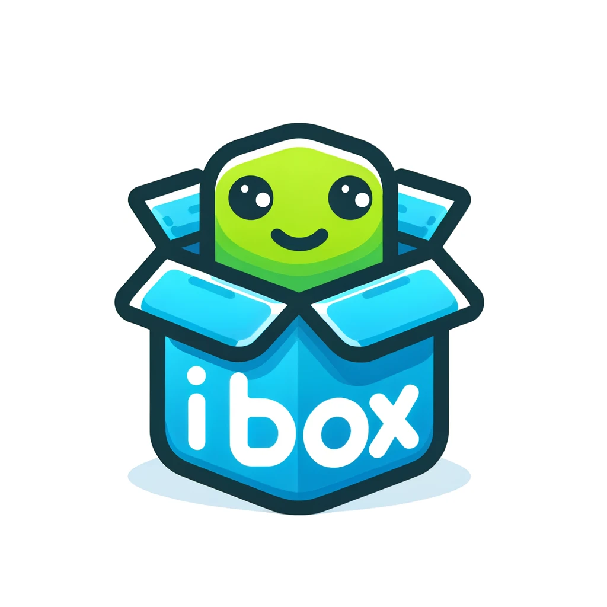

# ibox



**ibox** is a tool designed to simplify the deployment and testing of applications by running them inside Docker containers. It abstracts the complexity of Docker commands into a simple interface, allowing developers to launch applications "out of the box".
- **Simple Command Line Interface**: Run applications with simple commands.
- **Port Mapping Support**: Out of the box, all application ports are mapped to the host.
- **Lightweight and Fast**: Minimal overhead and speedy execution of containers.

## Getting Started

### Prerequisites
Ensure you have Docker installed on your machine. ibox interfaces directly with Docker, so it's required for operation.

### Usage


To run an application using ibox:


```sh
ibox node test.js
```

```sh
ibox npm install
```

```sh
ibox cast call 0x6b175474e89094c44da98b954eedeac495271d0f 'totalSupply()(uint256)' --rpc-url https://eth-mainnet.alchemyapi.io/v2/Lc7oIGYeL_QvInzI0Wiu_pOZZDEKBrdf
```
