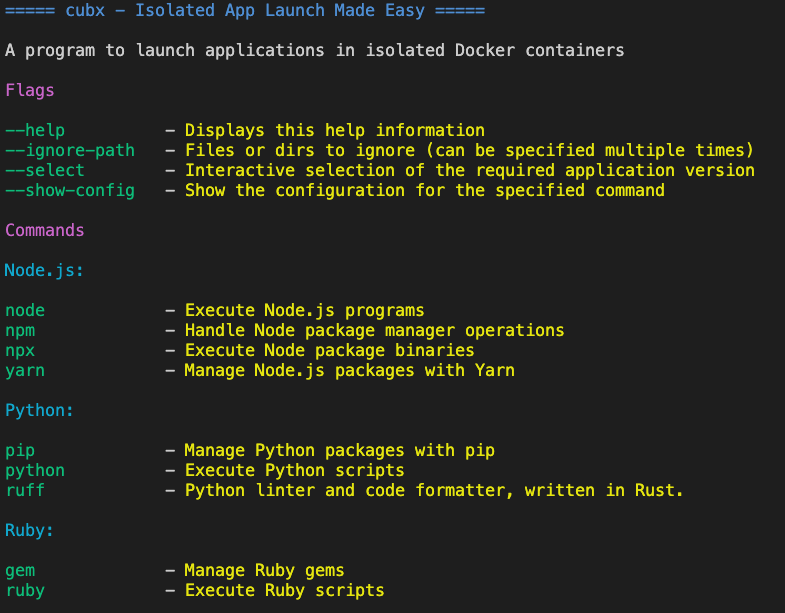
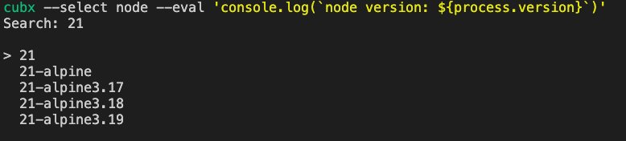
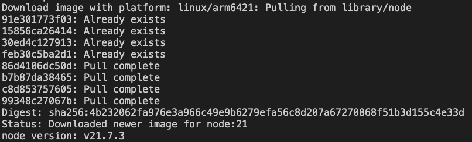

# Cubx


**Cubx** is a versatile tool that simplifies running console programs inside Docker containers. It is suitable for anyone who wants to use applications without the need to install them on their device, providing ease and convenience in operation.
- **Simple Command Line Interface**: Run applications with simple commands as if they were installed locally.
- **Port Mapping Support**: All application ports are automatically mapped to the host.
- **Lightweight and Fast**: Minimal overhead and speedy execution of containers.
- **Automatic Working Directory Mounting**: Automatically mounts the working directory as if you were running the program locally.
- **Automatic Platform Detection**: Automatically detects your OS and processor architecture to download the most suitable container image.
- **Flexible Software Versioning**: Use any version of the software by specifying the image tag after a colon. For example: `cubx node:14 test.js`, `cubx npm:14 install`, `cubx yarn:14 add [package]`.

## Getting Started

### Prerequisites
Ensure you have Docker installed on your machine. **Cubx** interfaces directly with Docker, so it's required for operation.

#### MacOS

If you are using macOS, you need to enable the net=host feature in Docker Engine. This feature allows port mapping to the host. While this functionality is enabled by default on Linux, it is still in beta on macOS and requires manual activation.

For more information, visit the following link: [Docker Desktop Network Drivers](https://docs.docker.com/network/drivers/host/#docker-desktop)

### Installation

> [!WARNING]
> The project is currently under development

Clone the project repository:

```bash
git clone git@github.com:eddort/cubx.git
```

Navigate to the project directory:

```bash
cd cubx
```

Build the project:

```bash
go build
```

You can now use the command:

```bash
./cubx
```

> [!NOTE]
> To make `cubx` available globally, you can add it to your `PATH` variable.

## Usage
Cubx has a set of preset programs. You can check the list of available programs with the command:

```sh
cubx -h
```

Output:



## Basic Usage

Cubx's main goal is to provide the easiest possible way to run applications inside containers, making it look like they are running locally.

```sh
cubx node --eval 'console.log(`node version: ${process.version}`)'
```

This is analogous to running the command without Cubx:

```sh
node --eval 'console.log(`node version: ${process.version}`)'
```

Output:

```sh
node version: v22.1.0
```

The output may differ if you don't have Node.js installed or if you don't have the latest version.

By using Cubx, you run programs in an isolated environment with several advantages:

- The application runs in a separate container.
- Only the current volume is mounted, keeping your data in other directories safe.
- You can restrict access to specific folders or files in the working directory.
- You can disconnect the application from the local network or the entire Internet.

### Examples in Other Languages

**Python**

```sh
cubx python -c 'import sys; print(f"Python version: {sys.version}")'
```

Output:

```sh
Python version: 3.12.3 (main, May 14 2024, 05:40:55) [GCC 12.2.0]
```

**Ruby**

```sh
cubx ruby -e 'puts "Ruby version: #{RUBY_VERSION}"'
```

Output:

```sh
Ruby version: 3.3.1
```

## Features

### Version Control
Cubx provides a user-friendly interface for working with different versions of applications. For example, Node.js has nvm, but not all programs have an equivalent. Cubx allows you to specify the version easily by adding `:version` to your command.

```sh
cubx node:14 --eval 'console.log(`node version: ${process.version}`)'
```

Output:

```sh
node version: v14.21.3
```

This works for any program that has a Docker registry.

### Interactive Version Selection

If you don't know the exact versions available and don't want to search the internet, you can use the `--select` flag to activate the interactive version selection interface.

```sh
cubx --select node --eval 'console.log(`node version: ${process.version}`)'
```

Select:



Result:



### File Exclusion

You may need to restrict access to certain files and folders. For example, you might store a `.env` file with keys you don't want to lose access to. Running dependencies in Node.js can compromise your data due to unscrupulous third-party code, and this can happen on any platform that executes code downloaded from the Internet.

Let's demonstrate with an example:

`test-env.js`
```js
const fs = require('fs').promises;
const path = require('path');

async function readEnvFile() {
    try {
        const envFilePath = path.resolve(__dirname, '.env');
        const data = await fs.readFile(envFilePath, 'utf8');
        console.log(data);
    } catch (err) {
        console.error('Error reading .env file:', err);
    }
}

readEnvFile();
```

`.env`
```env
SOME_PRIVATE_KEY=123
```

Create the file and write the code in JavaScript to read the local configuration file and output it to the console, simulating a malicious script.

Run the script:

```sh
cubx node test-env.js 
```

Output:

```sh
SOME_PRIVATE_KEY=123
```

Our script reads the configuration without problems and outputs everything to the console.

Now, exclude the file and try again:

```sh
cubx --ignore-path .env node test-env.js 
```

Output:

```sh
```

The output is empty because the file is excluded in the container when the program is called.

## Configuration

### What is Configuration in the Context of Cubx?

All programs that can be run with Cubx are described in a configuration that defines how to map commands to the Docker container, Docker image, command, description, and container settings at startup.

To view the configuration of any built-in command:

```sh
cubx --show-config node
```

Output:

```sh
---
name: node
image: node
command: node
serializer: ""
description: Execute Node.js programs
default_tag: ""
category: Node.js
hooks: []
settings:
    net: ""
    ignore_paths: []
```

### Creating Custom Commands

Cubx allows you to create your own custom commands similar to the built-in commands. This flexibility lets you extend the functionality of Cubx to suit your specific needs.

To create your own commands, follow these steps:

1. Create a folder named `.cubx` in your home directory (if it doesn't already exist).
2. Inside this folder, create a file named `config.yaml`.
3. Add your configuration to `config.yaml` following the example format below.

#### Example Configuration

Here is an example configuration for a custom command:

```yaml
programs:
  - name: httpie
    image: alpine/httpie
    command: http
    description: A user-friendly HTTP client for the command line
    default_tag: "latest"
    category: Network
    hooks: []
    settings:
      net: ""
      ignore_paths: []
    # Example usage: 
    # cubx http GET https://example.com
```

This configuration defines a new command `httpie` that uses the `alpine/httpie` image from Docker Hub. The command can be used to make HTTP requests in a user-friendly way.

### Using Custom Commands

After adding your custom command to `config.yaml`, Cubx will read the configuration upon the next startup and extend the available commands with your new command. You can verify this by running:

```sh
cubx -h
```

You should see your custom command listed among the available commands.

### Verifying Custom Command

To check that everything is working correctly, you can execute a command using your new configuration. For example, to use the `httpie` command to make a GET request to a website, run:

```sh
cubx httpie GET https://example.com
```

This command makes a GET request to `https://example.com` and displays the response in a user-friendly format.

### More Examples

For more examples, you can visit the [Cubx Examples Directory](https://github.com/eddort/cubx/tree/main/examples).

By following these steps, you can easily extend Cubx with custom commands to enhance its functionality and adapt it to your specific use cases.

