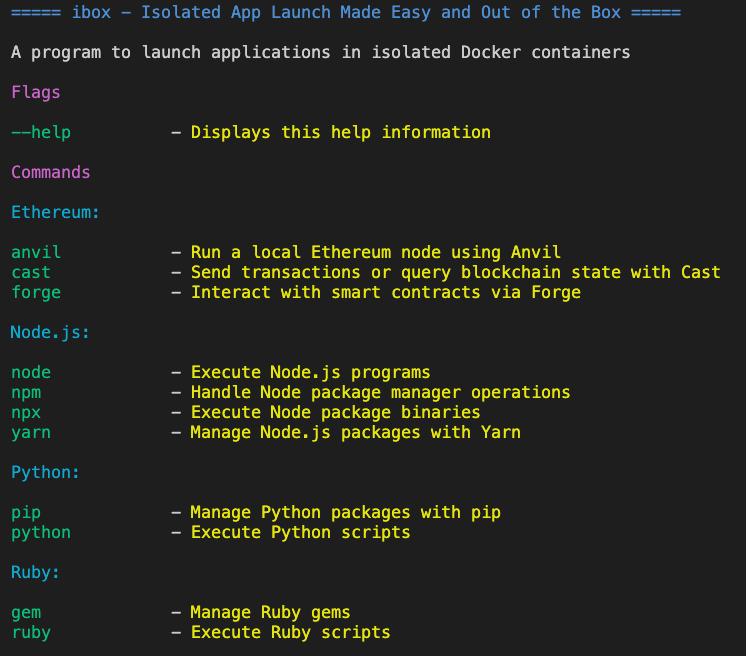

# cubx


**cubx** is a tool designed to simplify the deployment and testing of applications by running them inside Docker containers. It abstracts the complexity of Docker commands into a simple interface, allowing developers to launch applications "out of the box".
- **Simple Command Line Interface**: Run applications with simple commands as if they were installed locally.
- **Port Mapping Support**: Out of the box, all application ports are automatically mapped to the host.
- **Lightweight and Fast**: Minimal overhead and speedy execution of containers.
- **Automatic Working Directory Mounting**: Automatically mounts the working directory as if you were running the program locally.
- **Automatic Platform Detection**: Automatically detects your OS and processor architecture to download the most suitable container image.
- **Flexible Software Versioning**: Use any version of the software by specifying the image tag after a colon. For example: `node:14 test.js`, `npm:14 install`, `yarn:14 add [package]`.

## Getting Started

### Prerequisites
Ensure you have Docker installed on your machine. **cubx** interfaces directly with Docker, so it's required for operation.

#### MacOS

If you are using macOS, you need to enable the net=host feature in Docker Engine. This feature allows port mapping to the host. While this functionality is enabled by default on Linux, it is still in beta on macOS and requires manual activation.

For more information, visit the following link: https://docs.docker.com/network/drivers/host/#docker-desktop

### Installation
You need to clone the project repository:

```bash
git clone git@github.com:eddort/cubx.git
```

Then, navigate to the project directory:

```bash
cd cubx
```

Run the following command to build the project:

```bash
go build
```

Now, you can use the command:

```bash
./cubx
```

This will allow you to start using the `cubx` tool.

### Usage

To display the available programs, enter

```sh
cubx -h
```
Output:



To run an application using cubx:

```sh
cubx node test.js
```

```sh
cubx npm install
```

```sh
cubx cast call 0x6b175474e89094c44da98b954eedeac495271d0f 'totalSupply()(uint256)' --rpc-url https://eth-mainnet.alchemyapi.io/v2/Lc7oIGYeL_QvInzI0Wiu_pOZZDEKBrdf
```
